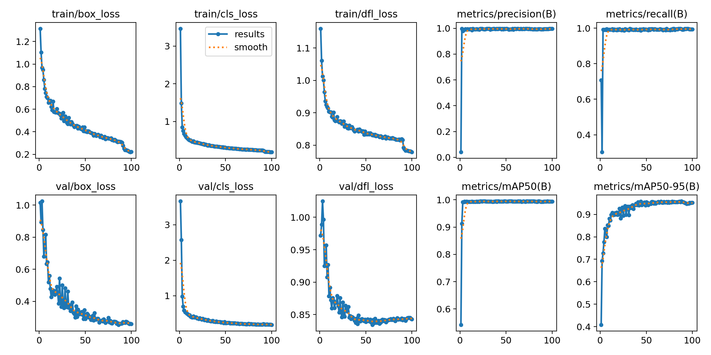
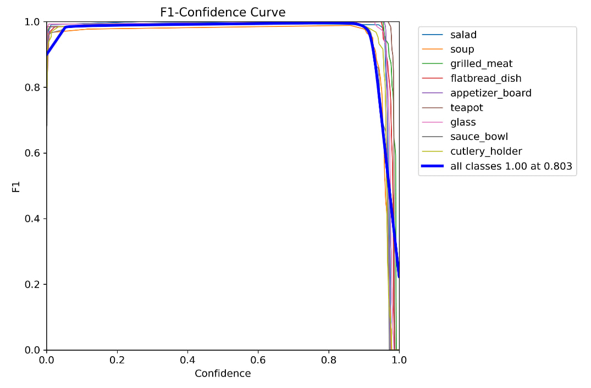
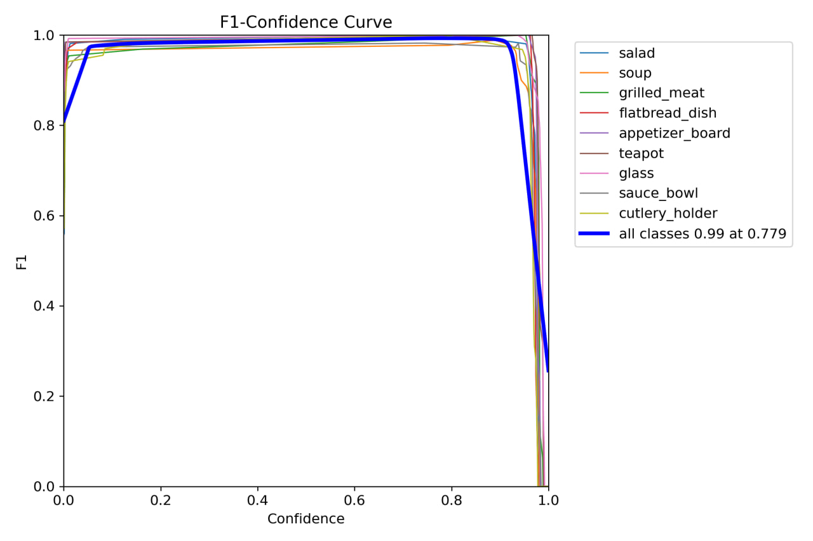
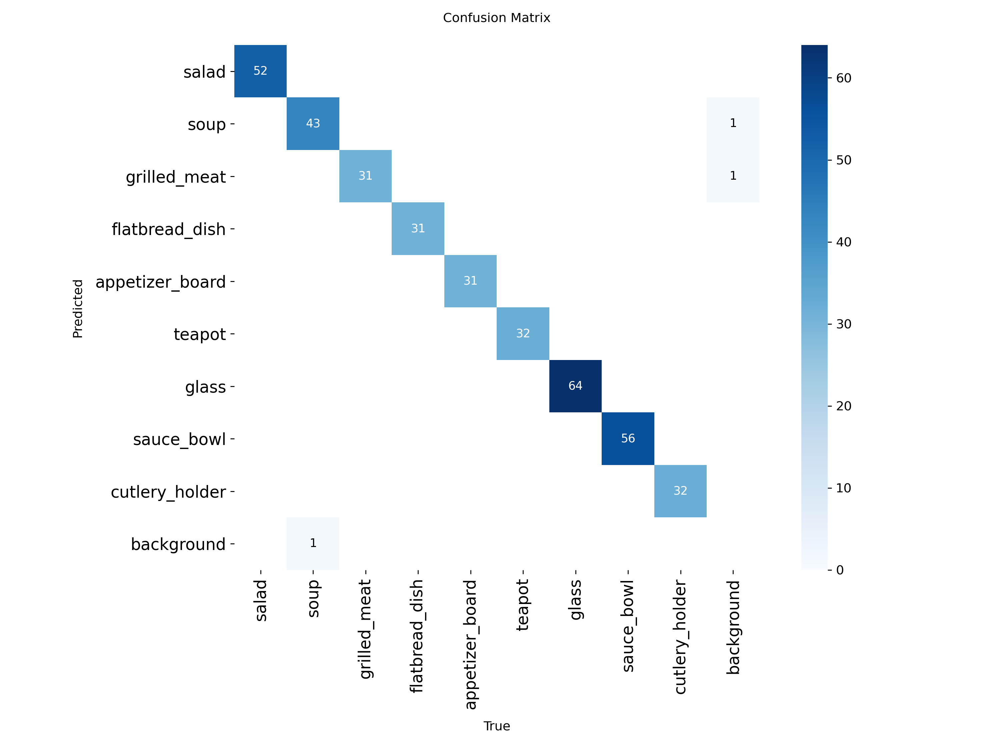

## Отчет по мыслям и выполненной работе

Исходя из задачи было принято во внимание то, что первым что я хочу сделать будет задачей ***нарезки кадков*** т.к проще взять конкретные фреймы и поделить их на конкртеные объекты чтобы их категоризировать.

По типу *аннотации классов* (например: pizza, soup, salad, drink)

Осталось их нарезать через cv2 каждые две секунды, чтобы кадров было не так много.

# Отчёт по тестовому заданию: Детекция блюд с помощью YOLOv11

**Автор:** lolukuk

**Позиция:** Python Developer (Computer Vision, ML)

## Введение

Целью данного задания была разработка мной модели для детекции разнообразных блюд на видео из ресторана. В качестве основы был использован фреймворк `Ultralytics` и модель **YOLOv11**.

---

## 1. Подготовка данных

Качество датасета — ключевой фактор успеха любой ML-модели. Этот этап включал в себя извлечение кадров, аннотацию, аугментацию и структурирование данных.

В данном случае я рассматривал *600-700* картинок, так же делал ручную выборку для того чтобы сборка была качественная и было не ниже порогового значения т.е >0.8

### 1.1. Извлечение кадров

*   **Источник:** Видеофайлы предоставленные из яндекс диска.
*   **Инструмент:** Скрипт `extract_frames.py` на основе `OpenCV`.
*   **Подход:** Чтобы избежать почти идентичных кадров, я извлекал по одному кадру каждые `2` секунды.
*   **Результат:** Было извлечено `~689` изображений для дальнейшей обработки.

### 1.2. Определение классов и аннотация

На основе анализа видеоматериала был сформирован список из **9 классов**. Я старался использовать обобщённые названия, чтобы модель могла детектировать разные вариации одного и того же типа блюд.

**Классы:** `salad`, `soup`, `grilled_meat`, `flatbread_dish`, `appetizer_board`, `teapot`, `glass`, `sauce_bowl`, `cutlery_holder`.

*   **Инструмент для аннотации:** `LabelImg`

В целом оказался весьма удобным, хоть и имел проблемы с совместимостью т.к программа была написана давно.
*   **Формат аннотаций:** YOLO (`.txt`). 

С конкретными значениями по текущим блокам.
*   **Основная сложность:** Аннотация объектов с частичной окклюзией (перекрытием), особенно на кадрах, где люди начинали есть. В таких случаях bounding box рисовался так, чтобы охватывать предполагаемые полные границы объекта, что нужно было для устойчивости модели, что и дало свои плоды в последующем.

### 1.3. Аугментация и разделение данных

Для увеличения разнообразия обучающих данных и предотвращения переобучения были применены аугментации **только для `train` выборки**.

*   **Библиотека:** `Albumentations`.

* Довольно удобная библиотека. Была реализована в скрипте `augment_data.py`.
*   **Применённые аугментации:**
    *   `HorizontalFlip` (p=0.5): имитация съёмки с другой стороны стола.
    *   `RandomBrightnessContrast` (p=0.7): имитация разного освещения в зале.
    *   `HueSaturationValue` (p=0.7): изменение оттенков для большей вариативности.
    *   `Blur`,`MotionBlur` (p=0.3): имитация лёгкой расфокусировки камеры.
    *   `ShiftScaleRotate` (p=0.7): движения по вертикали,

Данные были разделены в следующей пропорции:

*   **Train:** `70%`
*   **Validation:** `20%`
*   **Test:** `10%`

### 1.4. Структура датасета и `data.yaml`

Финальный датасет был организован в соответствии со структурой, требуемой YOLO. Конфигурационный файл `data.yaml`. По сути являлся конфигом для определения классов и их путей.

---

## 2. Обучение модели

Было проведено две итерации обучения для получения baseline и последующей оптимизации.

### 2.1. Baseline-модель (Первая итерация)

*   **Цель:** Получить базовые метрики и понять, в какую сторону двигаться.
*   **Модель:** `yolov11n.pt` (nano-версия, быстрая и лёгкая ~2млн параметров, что не так много, но мне хватило 8 часов).
*   **Параметры:** `epochs=100`, `imgsz=640`, `batch=16`.
*   **Результаты:**

**Анализ:** 

Стабильное обучение, получилось без переобучения: И `train_loss`, и `val_loss` последовательно ***снижались*** на протяжении всех 100 эпох. 

Отсутствие расхождения между этими кривыми (В том числе, когда `val_loss` начинает расти) свидетельствует о хорошей способности модели и отсутствии переобучения.

Высокая точность: Метрики precision и recall имеют практически идеальные значений, а значит предполагает высокую надёжность детекций(хотелось бы :).

Выход в итоге: Основная метрика mAP50-95 по, что основной прирост качества произошёл в первые 50-60 эпох. 

После 80-й эпохи график почти выровнялся, достигнув пикового значения около 0.94. Хотя кривая всё ещё имеет минимальный положительный наклон, дальнейшее увеличение количества эпох, скорее всего, даст лишь незначительный прирост. 

Модель достигла своего практического потолка на данном датасете и с данной архитектурой.

Так же было произведено сравнение двух разных моделей v8 и v11.

* `Yolo8n` модель

* `Yolo11n` модель

Что показало в итоге, что v8 гораздо лучше воспринимает статику, чем движение, а v11 наоборот начинает воспринимать лучше движение, но иногда ей не хватает **лучшего распознавания вещей** в том числе.

### 2.3. Сравнение результатов

| Метрика    | Итерация 1 (yolo8n, 100 эпох) | Итерация 2 (yolo11n, 100 эпох) | Изменение |
| ---------- |-------------------------------|--------------------------------|-----------|
| **mAP50-95** | `~0.95`                       | `0.94`                         | `-0.01`   |
| **mAP50**    | `1.00`                        | `0.99`                         | `-0.01`   |
| **precision**| `1.00`                | `~0.99`                         | `~ -0.01` |
| **recall**   | `1.00`                | `~0.99`                 | `~ -0.01` |

---

## 3. Анализ результатов и выводы

### 3.1. Анализ ошибок
**Матрица смежности (Confusion Matrix):**

**Наблюдения по матрице:**

* Матрица практически идеальна диагональна, что говорит о высокой способности модели различать классы. Нет ни одного случая, когда один тип блюда был бы спутан с другим (например, salad с soup).
* Все ошибки модели связаны с классом background, что является типичным для задач детекции. Было зафиксировано всего 3 ошибки на всем тестовом наборе:
  * Один пропуск (False Negative): Один экземпляр soup не был распознан.
  * Два ложных срабатывания (False Positive): Модель по одному разу ошибочно приняла фон за soup и grilled_meat.

### 3.2. Выводы

Обе модели показали хорошие результаты, что подтверждает довольно хорошо получившийся датасет и правильный выбранный подход.

Ключевые выводы, который хорошо зашли:

* Качество данных решает: Тщательная ручная аннотация, особенно в сложных случаях с окклюзией, что подтверждается практически идеальной матрицей смежности.
* Сравнительный анализ полезен: Обучение нескольких архитектур позволило не только выбрать модель с лучшими метриками (yolo8n), но и выявить качественные различия в их поведении (статика против динамики).
* Легкие модели эффективны: Даже nano-версии моделей YOLO способны решать данную задачу с хорошей эффективностью, что делает их минимально применимыми для развертывания на устройствах с ограниченными ресурсами или для работы в реальном времени.

Возможные дальнейшие шаги для улучшения(Как мне кажется):
* Для устранения оставшихся ошибок (ложные срабатывания на фоне) можно добавить в обучающий набор "негативные" примеры — кадры со сложными текстурами и тенями, но без объектов.
Эксперименты с более сложными аугментациями, имитирующими сильные перекрытия.

---

## 4. Итоговая информация

*   **Затраченное время:** Честно, примерно `25` часов c учетом обучения нескольких моделей.
*   **Опыт работы с YOLO до задания:** `Да`, но ранее просто баловался, настраивал и смотрел для себя как это в общем случае работает